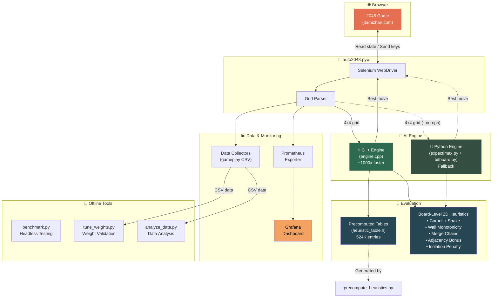

# 🎮 2048 Auto — AI-Powered Game Solver

An automated 2048 game-playing AI that uses **Expectimax search** with a high-performance **C++ bitboard engine** to consistently score 80,000+ points and reach the 4096/8192 tiles.

> **Latest Benchmark**: Average score **95,089** | Best: **133,524 (8192 tile)** | 4096+ rate: **100%**

---

## 🏗️ Architecture



| Component | File | Description |
|-----------|------|-------------|
| **Browser Driver** | `auto2048.pyw` | Connects to Chrome, reads game state, sends moves |
| **C++ Engine** | `2048_Auto_Cpp_Backend/engine.cpp` | Bitboard + Expectimax + 5 board heuristics |
| **Python Engine** | `expectimax.py` + `bitboard.py` | Pure Python fallback (slower) |
| **Heuristics** | `heuristics.py` | Advanced evaluation functions |
| **Benchmark** | `benchmark.py` | Headless game runner for testing |
| **Weight Tuner** | `tune_weights.py` | Validates heuristic weights against gameplay data |
| **Data Collection** | `data_collector.py`, `enhanced_data_collector.py` | Records gameplay for analysis |
| **Monitoring** | `prometheus_exporter.py`, `grafana_dashboard.json` | Real-time Grafana dashboards |

---

## 🚀 Quick Start

### Prerequisites

- **Python 3.10+**
- **Google Chrome** (for browser-based play)
- **g++ / clang++** with C++17 support (for the C++ engine)
- **NumPy** and **Selenium**

### 1. Install Dependencies

```bash
# Clone the repo
git clone <repo-url>
cd 2048_Auto

# Install Python packages
pip3 install numpy selenium webdriver-manager pandas prometheus_client
```

### 2. Build the C++ Engine (Recommended)

The C++ engine is **~1000x faster** than the Python engine and produces much higher scores.

```bash
cd 2048_Auto_Cpp_Backend

# Generate heuristic lookup tables
python3 precompute_heuristics.py

# Compile the engine
make

cd ..
```

You should see:
```
✅ Generated heuristic_table.h
   File size: 4.6 MB
   8 tables × 65536 entries = 524,288 total entries
```

### 3. Run a Headless Benchmark (No Browser Needed)

Test the AI without any browser setup:

```bash
# Run 5 games with the C++ engine (recommended)
python3 benchmark.py --cpp --games 5 -v

# Or use the Python engine (slower, ~10x less search depth)
python3 benchmark.py --games 5 -v
```

### 4. Play in the Browser (Full Mode)

#### Step 1: Start Chrome with Remote Debugging

Close all Chrome windows first, then:

```bash
# macOS
/Applications/Google\ Chrome.app/Contents/MacOS/Google\ Chrome \
  --remote-debugging-port=9222 \
  --user-data-dir=/tmp/chrome-debug-profile

# Linux
google-chrome --remote-debugging-port=9222 --user-data-dir=/tmp/chrome-debug-profile
```

#### Step 2: Navigate to the Game

In the Chrome window that opens, go to:
```
https://itamizhan.com/games/2048
```
Log in with Google if needed.

#### Step 3: Start the AI

```bash
# With C++ engine (recommended — scores 80K+ avg)
python3 auto2048.pyw --cpp

# With Python engine (fallback)
python3 auto2048.pyw
```

The AI will automatically:
- Connect to Chrome via remote debugging
- Switch into the game iframe
- Read the board state every ~80ms
- Compute the best move using Expectimax search
- Send arrow key presses to play
- Click "Keep Playing" after reaching 2048
- Auto-restart on game over

---

## 📊 Monitoring (Optional)

### Grafana + Prometheus Dashboard

```bash
# Start Prometheus and Grafana (requires Docker)
docker-compose up -d

# The AI auto-exports metrics on port 8000
# Grafana dashboard: http://localhost:3000
# Import: grafana_dashboard.json
```

### Analyze Gameplay Data

```bash
# Analyze historical gameplay data
python3 analyze_data.py

# Validate heuristic weights against gameplay data
python3 tune_weights.py --validate
```

---

## 🧠 How the AI Works

### Expectimax Search

The AI treats 2048 as a two-player game:
1. **Player** (maximizer): Chooses the move (UP/DOWN/LEFT/RIGHT) that maximizes the board's heuristic value
2. **Random spawner** (chance node): Places a new tile (90% chance of 2, 10% chance of 4) in a random empty cell

The search tree is explored to depth **7-12+** depending on the game phase, using:
- **Iterative deepening** — starts shallow, goes deeper if time budget allows
- **Transposition table** — 16M-entry hash table caches previously evaluated boards
- **Move ordering** — evaluates best moves first for better TT hit rates
- **Star-max pruning** — skips unlikely tile-4 spawns at shallow depths
- **Probability pruning** — uses quick evaluation for cells contributing < 1% probability

### Board Heuristics

The evaluation function combines **row/column table lookups** (precomputed for all 65,536 possible rows) with **board-level 2D analysis**:

| Heuristic | Weight | Purpose |
|-----------|--------|---------|
| **Empty cells** | 270.0 | Most critical — more space = more options |
| **Monotonicity** | 47.0 | Penalizes ordering violations (scaled by tile²) |
| **Merge potential** | 11.0 | Rewards adjacent equal tiles (scaled by tile²) |
| **Smoothness** | 3.0 | Penalizes large adjacent value differences |
| **Corner + Snake** | 15.0× | Max tile in corner + snake pattern alignment |
| **Wall monotonicity** | 6.0× | Strict ordering along edges from corner |
| **Merge chains** | 4.0× | 4096→2048→1024→512 sequences |
| **Adjacency** | 5.0× | 2nd-highest tile next to highest |
| **Isolation penalty** | -8.0× | Penalizes trapped small tiles |

### Bitboard Representation

The 4×4 board is encoded as a single **64-bit integer**:
- Each cell uses **4 bits** storing `log₂(tile_value)`
- Cell values: `0=empty, 1=2, 2=4, 3=8, ..., 13=8192`
- Moves are **O(1) table lookups** — just 4 array accesses per move

---

## 📁 Project Structure

```
2048_Auto/
├── auto2048.pyw              # Main browser driver
├── benchmark.py              # Headless benchmark runner
├── bitboard.py               # Python bitboard engine
├── expectimax.py             # Python Expectimax search
├── heuristics.py             # Python heuristic functions
├── tune_weights.py           # Weight validation tool
├── analyze_data.py           # Gameplay data analyzer
├── data_collector.py         # Basic data collection
├── enhanced_data_collector.py # Detailed data collection
├── prometheus_exporter.py    # Prometheus metrics
├── grafana_dashboard.json    # Grafana dashboard config
├── docker-compose.yml        # Prometheus + Grafana stack
├── requirements.txt          # Python dependencies
├── gameplay_data.csv          # Historical game data
├── enhanced_gameplay_data.csv # Detailed game data (162K moves)
├── game_summaries.csv         # Per-game summary stats
│
└── 2048_Auto_Cpp_Backend/    # C++ Engine (recommended)
    ├── engine.cpp            # Expectimax + heuristics
    ├── cpp_engine.py         # Python ↔ C++ bridge (ctypes)
    ├── precompute_heuristics.py # Generates lookup tables
    ├── heuristic_table.h     # Precomputed tables (auto-generated)
    ├── Makefile              # Build system
    └── test_cpp.py           # Engine tests
```

---

## 🏆 Performance History

| Version | Avg Score | Best Score | 4096+ Rate | 8192+ Rate |
|---------|-----------|-----------|------------|------------|
| Original Python | ~30,000 | ~50,000 | ~30% | 0% |
| Enhanced Python | 49,295 | 129,276 | 50% | 4.3% |
| **C++ Redesign (current)** | **95,089** | **133,524** | **100%** | **33%** |

---

## Credits

- **Original 2048 game**: [Gabriele Cirulli](https://gabrielecirulli.github.io/2048/)
- **Original bot**: [Wenhe Ye](https://www.youtube.com/watch?v=PYhZ1G-3Ip8)
- **AI research**: [nneonneo/2048-ai](https://github.com/nneonneo/2048-ai) — CMA-ES weight optimization
- **Game host**: [itamizhan.com/games/2048](https://itamizhan.com/games/2048)
